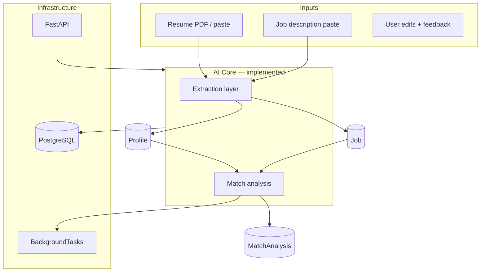
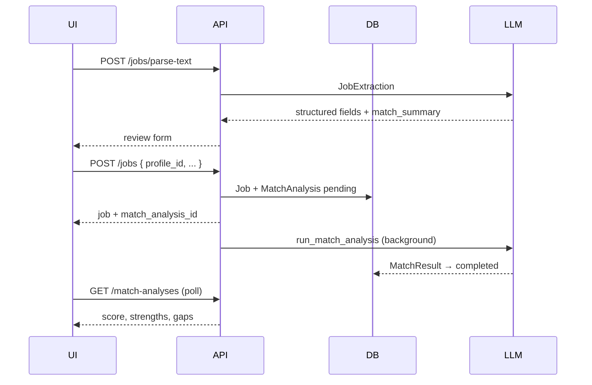

# Architecture

## High-level system map



We build **inside-out**, not top-down. Not "agent framework first."

## Current stack

| Layer | Technology | Status |
|-------|-----------|--------|
| API | FastAPI (async) | Implemented |
| Database | PostgreSQL 16 | Implemented |
| ORM | SQLAlchemy 2.0 (async) | Implemented |
| Migrations | Alembic | Implemented |
| Validation | Pydantic v2 | Implemented |
| LLM | OpenAI-compatible client (cloud + local) | Implemented |
| Background work | FastAPI `BackgroundTasks` | Implemented |
| Frontend | Vite, React, TypeScript, Tailwind | Implemented |
| Observability | Structured logging | Partial |

## Request flow: match on job insert



## Data model

```
Profile ──┐
          ├── MatchAnalysis (status: pending → completed | failed)
Job ──────┘
```

### Profile

Source of truth for matching. Stores raw resume text plus structured extraction.

```python
Profile
├── id: UUID
├── name: str
├── headline: str | None
├── resume_text: str          # raw input for LLM
├── structured_data: JSONB    # ResumeExtraction snapshot
├── created_at, updated_at
```

### Job

User-pasted opportunity with optional structured metadata from extraction.

```python
Job
├── id: UUID
├── title, company, description
├── location, url, source
├── raw_metadata: JSONB       # JobExtraction fields, screening_card, requirements
├── company_brief: JSONB      # CompanyBrief snapshot (optional)
├── created_at, updated_at
```

### MatchAnalysis

Links a profile to a job. The `result` JSONB column holds structured LLM output (`MatchResult`).

```python
MatchAnalysis
├── id: UUID
├── profile_id → Profile
├── job_id → Job
├── status: pending | completed | failed
├── result: JSONB             # MatchResult
├── error: str | None
├── created_at
```

Every analysis is persisted and auditable. This becomes the eval dataset.

## Services

| Service | Role |
|---------|------|
| `resume_structurer.py` | PDF text → `ResumeExtraction` |
| `job_structurer.py` | Paste → `JobExtraction` |
| `screening_card.py` | Compress job context for metadata |
| `match/` | Profile + Job → `MatchResult` (progressive: screen → full) |
| `company_research.py` | Bounded agent loop → web search → `CompanyBrief` |
| `cover_letter_generator.py` | 3-pass cover letter chain |
| `resume_optimizer.py` | Gap-driven resume suggestions |
| `search/` | `SearchClient` protocol + DuckDuckGo adapter |
| `llm/` | Provider-agnostic structured output client |

API routes live under `app/api/` — `profiles.py`, `jobs.py`, `match_analyses.py`, plus `settings` and `llm`.

## Design decisions

### JSONB for evolving schemas

`structured_data` (Profile) and `result` (MatchAnalysis) use JSONB so the LLM output schema can iterate without migrations. Once stable, promote hot fields to columns.

**When to promote:** When you query the same JSONB field in WHERE clauses or need foreign keys.

### Match at intake, not in bulk

Product runs **one full analysis per job save**. Avoids comparative batching complexity for the common single-job workflow. See [m3-match-on-intake.md](milestones/m3-match-on-intake.md).

### No auth yet

Single-user local dev. Add authentication when multi-user or deployment becomes a requirement.

### Prompts as files

`app/prompts/*.txt` — version-controlled, loaded via `load_prompt()`. Prompts are the API contract with the model.

### MatchAnalysis as a separate entity

Not just a computed field. Every analysis is:

- Persisted for audit trail
- Available as eval data ("was this match explanation good?")
- Replayable ("re-run with updated prompt")

## What NOT to build yet

| Temptation | Why wait |
|-----------|----------|
| Agent framework (LangChain, etc.) | Bounded loops in Python suffice for research |
| Vector DB / RAG | Resume + JD fit in context; RAG solves retrieval-at-scale |
| Multi-agent orchestration | One well-evaluated pipeline beats five agents |
| Fine-tuning | Prompt + structure gets you 90% there |
| Auto-apply | Legal, ethical, trust issues — human approval gate comes much later |
| Job scraping | Manual JD input proves the AI core first |

## Production AI patterns

Production AI systems typically need:

- **Evals** — does the model do the right thing on representative inputs?
- **Observability** — trace every LLM call (inputs, outputs, latency, cost)
- **Structured outputs** — don't parse free-form text in production
- **Human-in-the-loop** — especially for high-stakes decisions

Traditional systems define correctness in code. AI systems define it by **behavior under distribution shift** — you can't unit-test your way to confidence on model output quality.
