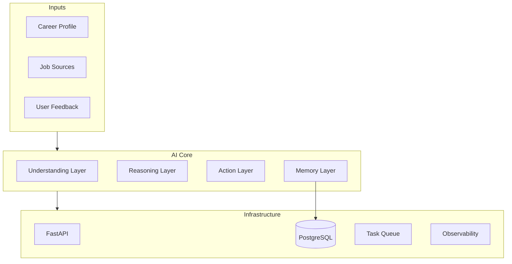

# Architecture

## High-level system map



We build **inside-out**, not top-down. Not "agent framework first."

## Current stack

| Layer | Technology | Status |
|-------|-----------|--------|
| API | FastAPI (async) | Implemented |
| Database | PostgreSQL 16 | Implemented |
| ORM | SQLAlchemy 2.0 (async) | Implemented |
| Migrations | Alembic | Implemented |
| Validation | Pydantic v2 | Implemented |
| LLM | TBD (OpenAI / Anthropic / local) | Not yet |
| Task queue | TBD | Not yet |
| Observability | TBD | Not yet |

## Data model (Milestone 1)

```
Profile ──┐
          ├── MatchAnalysis (status: pending → completed | failed)
Job ──────┘
```

### Profile

Source of truth for matching. Stores raw resume text plus optional structured data.

```python
Profile
├── id: UUID
├── name: str
├── headline: str | None
├── resume_text: str          # raw input for LLM
├── structured_data: JSONB    # parsed skills/experience (future)
├── created_at, updated_at
```

### Job

A job opportunity — manually added for now, discovered later.

```python
Job
├── id: UUID
├── title, company, description
├── location, url, source
├── raw_metadata: JSONB       # scraper/API payload (future)
├── created_at, updated_at
```

### MatchAnalysis

Links a profile to a job. The `result` JSONB column holds structured LLM output.

```python
MatchAnalysis
├── id: UUID
├── profile_id → Profile
├── job_id → Job
├── status: pending | completed | failed
├── result: JSONB             # structured LLM output
├── error: str | None
├── created_at
```

Every analysis is persisted and auditable. This becomes the eval dataset.

## Design decisions

### JSONB for evolving schemas

`structured_data` (Profile) and `result` (MatchAnalysis) use JSONB so the LLM output schema can iterate without migrations. Once stable, promote hot fields to columns.

**Why not separate tables for skills/gaps/strengths?** Premature — we don't know the schema yet. JSONB lets us learn.

**When to promote:** When you query the same JSONB field in WHERE clauses or need foreign keys.

### No auth yet

Single-user local dev. Add authentication when multi-user or deployment becomes a requirement.

### No service layer for CRUD

Routes talk to the DB directly. Fine at this scale. Extract to `services/` when AI logic lands — the matcher service will orchestrate LLM calls, validation, and persistence.

### MatchAnalysis as a separate entity

Not just a computed field. Every analysis is:

- Persisted for audit trail
- Available as eval data ("was this match explanation good?")
- Replayable ("re-run with updated prompt")

## What NOT to build yet

| Temptation | Why wait |
|-----------|----------|
| Agent framework (LangChain, etc.) | Don't know tool boundaries yet |
| Vector DB / RAG | Resume + JD fit in context; RAG solves retrieval-at-scale |
| Multi-agent orchestration | One well-evaluated pipeline beats five agents |
| Fine-tuning | Prompt + structure gets you 90% there |
| Auto-apply | Legal, ethical, trust issues — human approval gate comes much later |
| Job scraping | Manual JD input proves the AI core first |

## Production AI patterns

Production AI systems typically need:

- **Evals** — does the model do the right thing on representative inputs?
- **Observability** — trace every LLM call (inputs, outputs, latency, cost)
- **Structured outputs** — don't parse free-form text in production
- **Human-in-the-loop** — especially for high-stakes decisions

Traditional systems define correctness in code. AI systems define it by **behavior under distribution shift** — you can't unit-test your way to confidence on model output quality.
