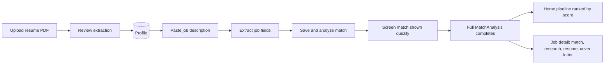

# Project Status

Last updated: 2026-07-28

## Where we are

AI Career OS has a working **resume → job → explainable match → act** loop with **web-grounded company research**. The product is intentionally narrow: paste your data, get evidence-backed analysis — no black-box auto-apply.

**Current milestone:** M6 complete. **Next:** M7 — job discovery.

## Product flow (today)

1. **Onboarding** — PDF → LLM structured extraction → human review → save profile.
2. **Add job** — paste JD → extract fields → **Save & analyze match** (sends `profile_id`).
3. **Progressive match** — fast screen result while pending; full strengths/gaps when complete.
4. **Job detail** — company research (plan → search → synthesize), resume optimization, cover letter.
5. **Home pipeline** — jobs ranked by match score.

## Implemented

| Area | Status |
|------|--------|
| Resume PDF extraction + structured `ResumeExtraction` | Done |
| Profile CRUD + settings (BYOM: cloud + local) | Done |
| Job paste → `JobExtraction` + review UI | Done |
| Explainable match + match on job insert | Done |
| Progressive match (screen → full at intake) | Done |
| Resume optimization (gap → suggestions → apply) | Done |
| Cover letter (draft → critique → revise, max 400 chars) | Done |
| Company research (plan → web search → brief + sources) | Done |
| Home job pipeline with polling | Done |
| Eval harness (6 suites) | Done |
| LLM + tool call tracing | Done |
| Screening card + `match_summary` at job extract | Done |

## API surface (`/api/v1/`)

| Resource | Key endpoints |
|----------|----------------|
| Profiles | CRUD, `POST /profiles/parse-resume`, `GET /profiles/{id}/resume.pdf` |
| Jobs | CRUD, `POST /jobs/parse-text`, `POST /jobs` (progressive match), `POST /jobs/{id}/company-research` |
| Match analyses | `POST /match-analyses` (manual full re-analyze), list, get |
| Match actions | `POST /match-analyses/{id}/resume-optimization`, `POST /match-analyses/{id}/cover-letter` |
| Settings | GET/PUT LLM provider config |
| LLM | `POST /llm/models` |

Interactive docs: http://127.0.0.1:8000/docs

## What's next (M7+)

| Priority | Milestone | Why |
|----------|-----------|-----|
| **Next** | [M7 — Job discovery](milestones/README.md) | Official APIs for job feeds |
| Soon | Re-analyze on job update | JD edits should refresh match |
| Soon | Tavily/Serper search in settings | Production-grade search |
| Soon | Company brief → cover letter context | Richer outreach |
| Cleanup | Prune unused batch/cascade backend | After evals cover primary paths |

## Intentionally deferred

- Authentication (single-user local dev)
- Vector DB / RAG (resume + JD fit in context today)
- Agent frameworks (orchestrated tool loops only)
- Auto-apply

## References

- [AI engineering patterns](ai-engineering.md)
- [M6: Company research](milestones/m6-company-research.md)
- [Architecture](architecture.md)
- [Milestones](milestones/README.md)
