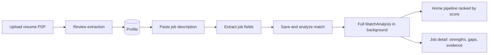

# Project Status

Last updated: 2026-07-28

## Where we are

AI Career OS has a working **resume → job → explainable match** loop. The product is intentionally narrow: paste your data, get evidence-backed fit analysis — no black-box auto-apply.

**Current milestone:** M4 complete. **Next:** M5 — cover letter generation.

## Product flow (today)

1. **Onboarding** — PDF → LLM structured extraction → human review → save profile.
2. **Add job** — paste JD → extract fields → **Save & analyze match** (sends `profile_id`).
3. **Match runs automatically** — full `match_analysis` prompt, not a separate bulk step.
4. **Home pipeline** — jobs ranked by match score; polls while analyses are pending.
5. **Job detail** — deep dive; Re-analyze / Retry when needed.

## Implemented

| Area | Status |
|------|--------|
| Resume PDF extraction + structured `ResumeExtraction` | Done |
| Profile CRUD + settings (BYOM: cloud + local) | Done |
| Job paste → `JobExtraction` + review UI | Done |
| Explainable match + match on job insert | Done |
| Resume optimization (gap → suggestions → apply) | Done |
| Home job pipeline with polling | Done |
| Eval harness (4 suites: resume, job, match, optimization) | Done |
| LLM call tracing (latency, tokens, operation) | Done |
| Screening card + `match_summary` at job extract | Done (infra for future cost optimization) |

## API surface (`/api/v1/`)

| Resource | Key endpoints |
|----------|----------------|
| Profiles | CRUD, `POST /profiles/parse-resume` |
| Jobs | CRUD, `POST /jobs/parse-text`, `POST /jobs` (optional `profile_id` → queues match) |
| Match analyses | `POST /match-analyses` (manual re-analyze), list, get |
| Settings | GET/PUT LLM provider config |
| LLM | `POST /llm/models` |

Interactive docs: http://127.0.0.1:8000/docs

## Pivot history (why docs mention “batch”)

We briefly shipped **bulk batch matching** (one comparative LLM call for many jobs) and explored a **tiered cascade** (cheap screen → full analyze top K). At typical intake volume (one job at a time), that added UX complexity without enough benefit.

**Product decision:** run a **full detailed match when each job is saved**. Batch/cascade code remains in the repo for experiments but is not exposed in the API or UI.

See [M3: Match on job insert](milestones/m3-match-on-intake.md) and [M3 batch (archived)](milestones/m3-batch-matching.md).

## What's next (M5+)

| Priority | Milestone | Why |
|----------|-----------|-----|
| **Next** | [M5 — Cover letter generation](milestones/README.md) | Personalized outreach from match narrative |
| Soon | Re-analyze on job update | JD edits should refresh match without manual retry |
| Soon | Eval fixtures | Match-at-intake + resume optimization regression tests |
| Later | Job discovery (M7) | Official APIs only — no scraping |
| Cleanup | Prune unused batch/cascade backend | After evals cover primary paths |

## Intentionally deferred

- Authentication (single-user local dev)
- Vector DB / RAG (resume + JD fit in context today)
- Agent frameworks
- Auto-apply
- Job URL fetching / scraping

## Open questions

- [ ] Single LLM call for extract + match at paste time (latency vs. modularity)?
- [ ] When to promote hot JSONB fields to relational columns?
- [ ] Observability: trace LLM calls (latency, cost) in production?
